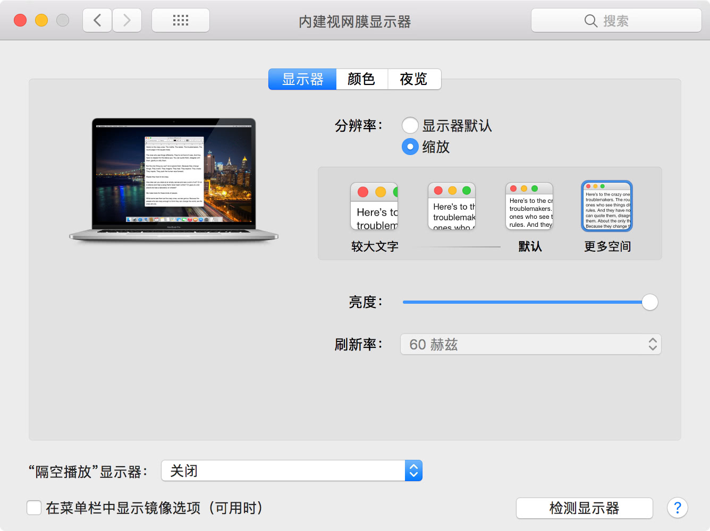
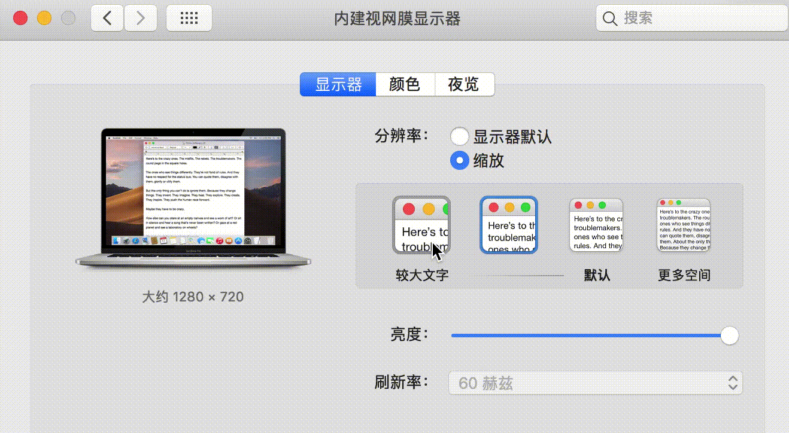
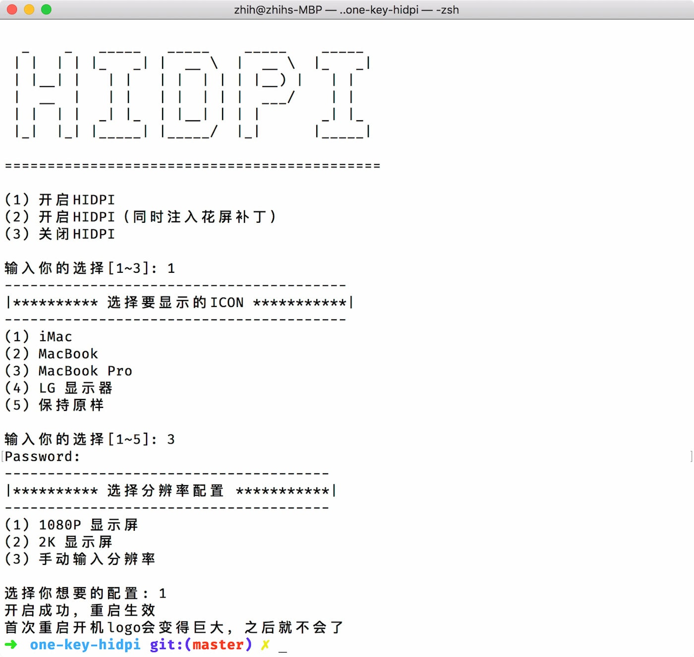

# 一键开启 macOS HiDPI

## 说明

[English](README.md) | [中文](README-zh.md)

 此脚本的目的是为中低分辨率的屏幕开启 HiDPI 选项，并且具有原生的 HiDPI 设置，不需要 RDM 软件即可在系统显示器设置中设置

macOS 的 DPI 机制和 Windows 下不一样，比如 1080p 的屏幕在 Windows 下有 125%、150% 这样的缩放选项，而同样的屏幕在 macOS 下，缩放选项里只是单纯的调节分辨率，这就使得在默认分辨率下字体和UI看起来很小，降低分辨率又显得模糊

同时，此脚本也可以通过注入修补后的 EDID 修复闪屏，或者睡眠唤醒后的闪屏问题，当然这个修复因人而异

开机的第二阶段 logo 总是会稍微放大，因为分辨率是仿冒的

设置：





## 使用方法

1.远程模式: 在终端输入以下命令回车即可

```bash
bash -c "$(curl -fsSL https://raw.githubusercontent.com/xzhih/one-key-hidpi/master/hidpi.sh)"
```

2.本地模式: 下载项目解压,双击 `hidpi.command` 运行



## 恢复

### 命令恢复

如果还能进系统，就再次运行命令选择选项 3 关闭 HIDPI。

### 恢复模式

如果使用此脚本后，开机无法进入系统，请到 macos 恢复模式，打开终端

这里有两种方式进行关闭，建议选第一种

1. 快捷恢复
    

```bash
ls /Volumes/
```

你会看到你的系统盘

```bash
cd /Volumes/你的系统盘/Users/

ls
```

你可以看到所有用户的家目录

```bash
cd 你的用户名

./.hidpi-disable
```

2. 手动恢复

使用终端删除 `Library/Displays/Contents/Resources/Overrides` 下删除所有通过外部注入的显示器配置文件夹

具体命令如下：

```bash
ls /Volumes/
rm -rf /Volumes/你的系统盘/Library/Displays/Contents/Resources/Overrides
```

## 从以下得到启发

https://www.tonymacx86.com/threads/solved-black-screen-with-gtx-1070-lg-ultrafine-5k-sierra-10-12-4.219872/page-4#post-1644805

https://github.com/syscl/Enable-HiDPI-OSX

