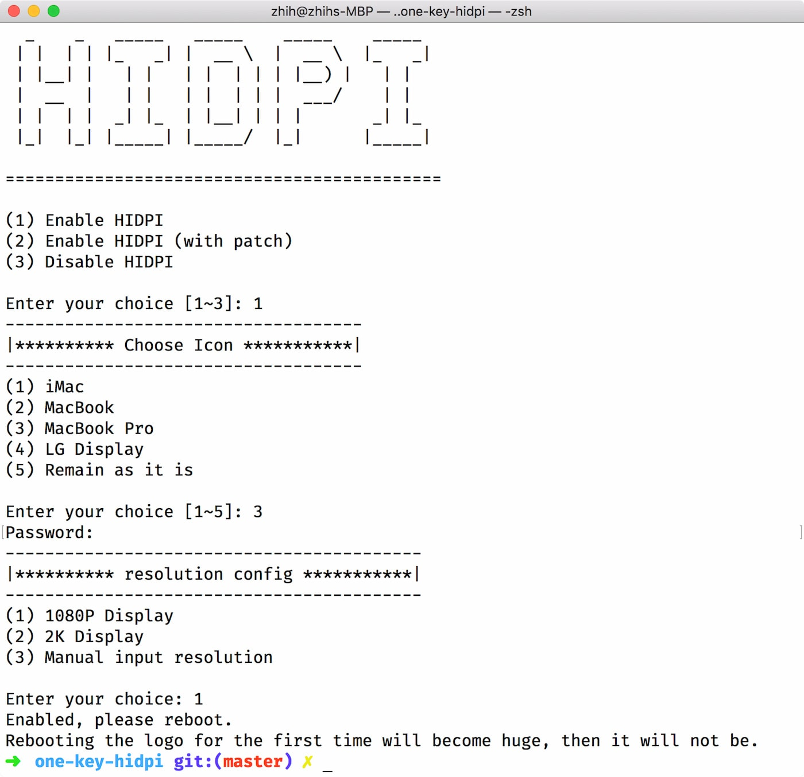

# Enable macOS HiDPI

## Explanation

[English](README.md) | [中文](README-zh.md)

 This script can simulate macOS HiDPI on a non-retina display, and have a "Native" Scaled in System Preferences.

Some device have wake-up issue, script's second option may help, it inject a patched EDID, but another problem may exists here.

Logo scaling up may not be resolved, cuz the higher resolution is faked.

System Preferences


## Usage

1.Remote Mode: Run this script in Terminal

```bash
bash -c "$(curl -fsSL https://raw.githubusercontent.com/xzhih/one-key-hidpi/master/hidpi.sh)"
```

2.Local Mode: Download ZIP, decompressing it, and double click `hidpi.command` to run



## Recovery

### Normal

Still running the script in the terminal, but choose option 3

### Recovery mode

If you cant boot into system, or get any another issues, you can boot into macOS Recovery mode, and use the Terminal.app

There are two ways to close it. It is recommended to choose the first one

1. 

```bash
ls /Volumes/
```

you can see all Disk.

```bash
cd /Volumes/"Your System Disk Part"/Users/

ls
```

you can see user home directory.

```bash
cd "user name"

./.hidpi-disable
```

2. 

Remove all injected display's DisplayVendorID folder under `Library/Displays/Contents/Resources/Overrides`

```bash
ls /Volumes/
rm -rf /Volumes/"Your System Disk Part"/Library/Displays/Contents/Resources/Overrides
```

## Inspired

https://www.tonymacx86.com/threads/solved-black-screen-with-gtx-1070-lg-ultrafine-5k-sierra-10-12-4.219872/page-4#post-1644805

https://github.com/syscl/Enable-HiDPI-OSX
